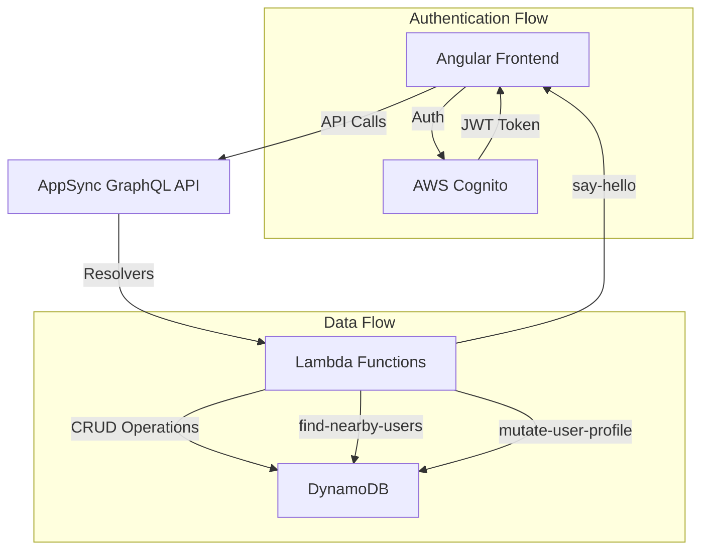
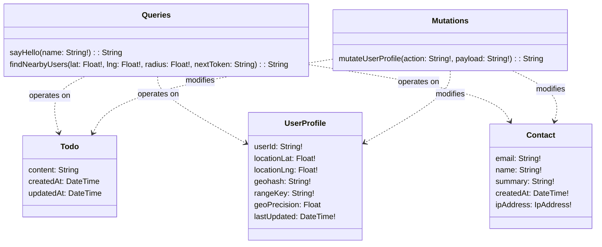
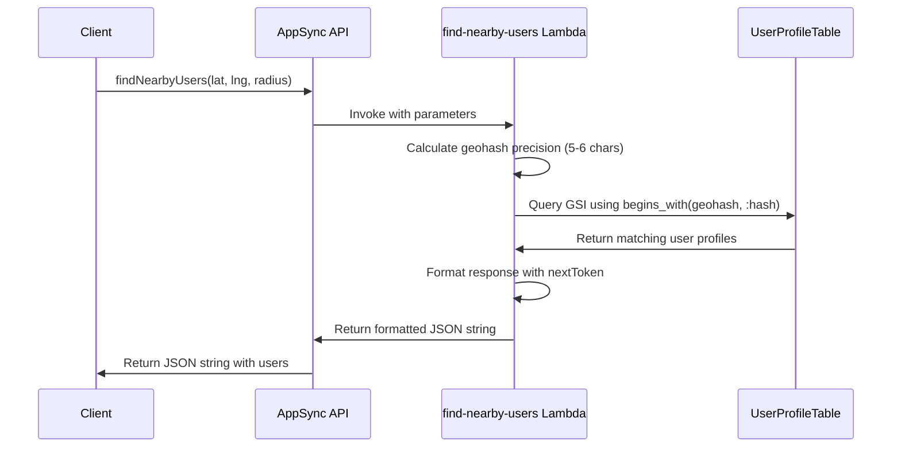
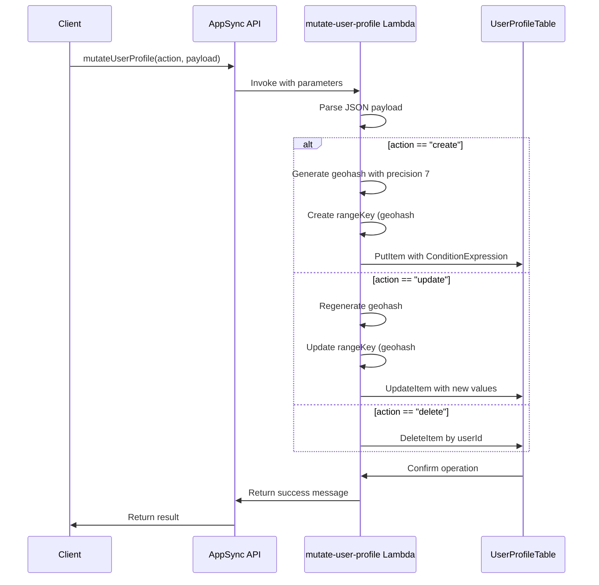
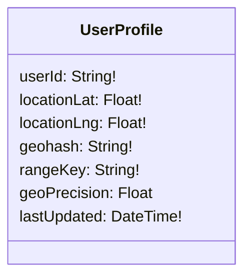
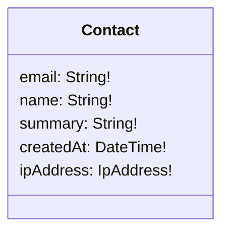
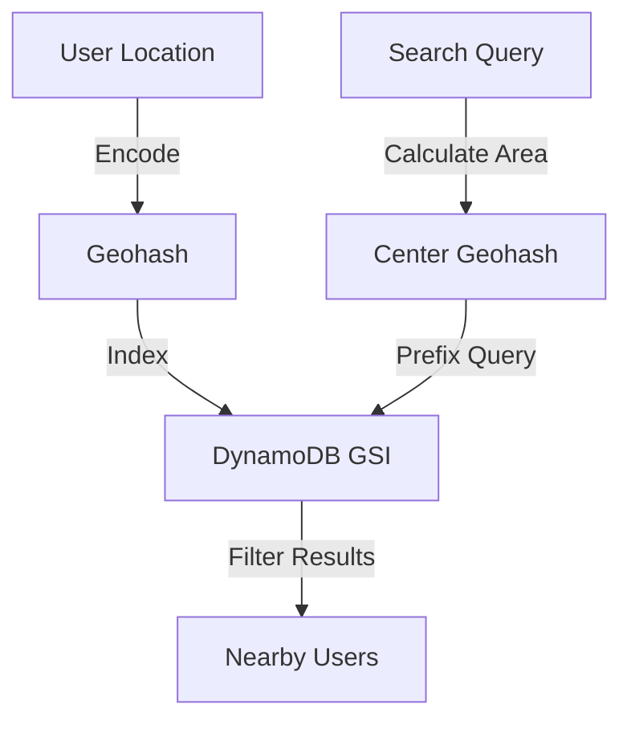
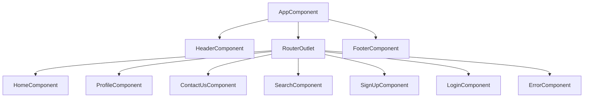
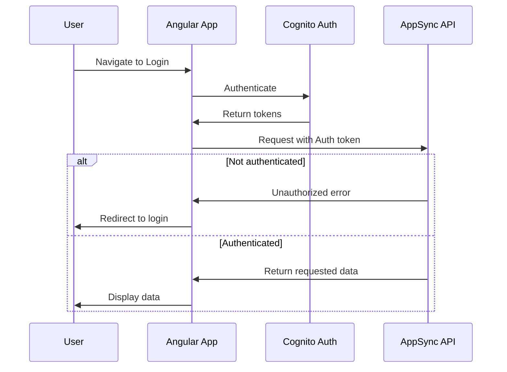
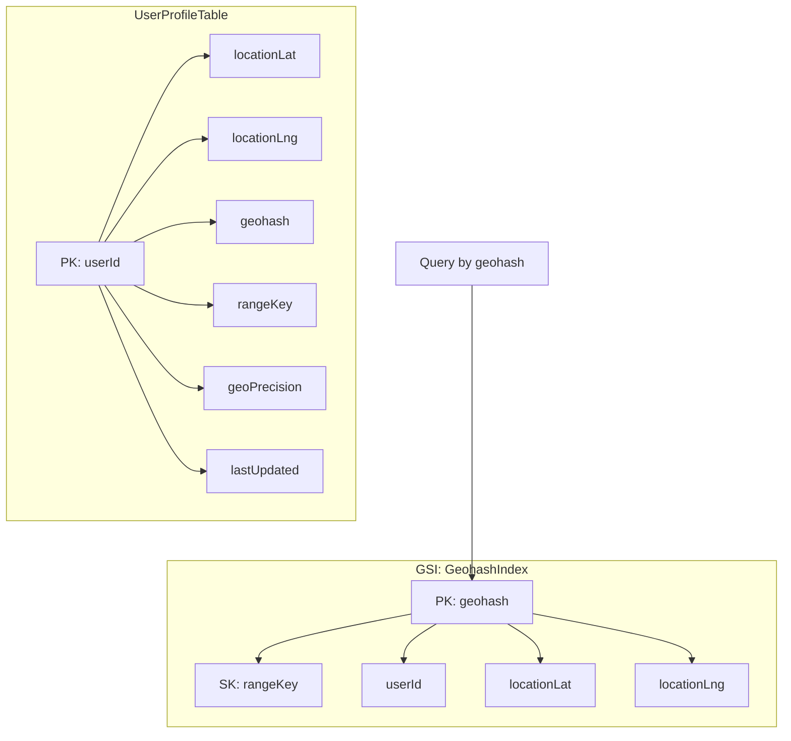

# Get Local Friends - Angular App with AWS Amplify Gen 2

This application helps users find and connect with people in their local area, built with Angular and AWS Amplify Gen 2.

## Application Overview

Get Local Friends is a platform that allows users to:
- Create profiles with geospatial information
- Search for other users within a specified radius
- Connect based on proximity and shared interests

## Tech Stack

- **Frontend**: Angular 17
- **Backend**: AWS Amplify Gen 2
- **Authentication**: AWS Cognito
- **Database**: Amazon DynamoDB
- **Deployment**: AWS Amplify Hosting

## Architecture



## API Endpoints

The application uses the following GraphQL API endpoints defined in `amplify/data/resource.ts`:



### Query: `sayHello`
- **Description**: Simple greeting function that returns a personalized message
- **Arguments**: `{ name: string }` (required)
- **Returns**: `string`
- **Handler**: `sayHello` Lambda function
- **Authorization**: Public API key access
- **Usage Example**:
  ```graphql
  query {
    sayHello(name: "Alice")
  }
  ```
- **Response Example**:
  ```json
  {
    "data": {
      "sayHello": "Hello, Alice!"
    }
  }
  ```

### Query: `findNearbyUsers`
- **Description**: Searches for users within a specified radius based on geospatial data
- **Arguments**: 
  - `lat: float` (required) - Latitude coordinate
  - `lng: float` (required) - Longitude coordinate
  - `radius: float` (required) - Search radius in miles (1-5)
  - `nextToken: string` (optional) - Pagination token
- **Returns**: `string` (JSON string containing `nearbyUsers` array and `nextToken`)
- **Handler**: `findNearbyUsers` Lambda function
- **Authorization**: Allows both guest and authenticated users
- **Usage Example**:
  ```graphql
  query {
    findNearbyUsers(
      lat: 42.12345
      lng: -71.98765
      radius: 3
    )
  }
  ```
- **Response Example**:
  ```json
  {
    "data": {
      "findNearbyUsers": "{\"nearbyUsers\":[{\"userId\":\"user123\",\"locationLat\":42.12567,\"locationLng\":-71.98123,\"lastUpdated\":\"2025-05-01T14:30:22Z\"}],\"nextToken\":null}"
    }
  }
  ```



### Mutation: `mutateUserProfile`
- **Description**: Creates, updates, or deletes user profile data with location information
- **Arguments**:
  - `action: string` (required) - One of: "create", "update", "delete"
  - `payload: string` (required) - JSON-encoded payload with profile data
- **Returns**: `string` (Success message)
- **Handler**: `mutateUserProfile` Lambda function
- **Authorization**: Authenticated users only
- **Payload Structure**:
  ```typescript
  // For create/update
  {
    userId: string;
    locationLat: number;
    locationLng: number;
  }
  
  // For delete
  {
    userId: string;
  }
  ```
- **Usage Example**:
  ```graphql
  mutation {
    mutateUserProfile(
      action: "create"
      payload: "{\"userId\":\"user123\",\"locationLat\":42.12567,\"locationLng\":-71.98123}"
    )
  }
  ```
- **Response Example**:
  ```json
  {
    "data": {
      "mutateUserProfile": "UserProfile for user123 created successfully."
    }
  }
  ```



### Data Models

The application defines the following data models:

#### `Todo` Model
- Standard to-do item with content and timestamps
- Authorization: Owner-based access control

#### `UserProfile` Model
- Stores user location data with geospatial indexing
- Uses geohash for efficient proximity searches
- Has a secondary index on the `geohash` field
- Authorization: Owner-based access control

#### `Contact` Model
- Stores contact form submissions
- Captures IP address and timestamp
- Authorization: Allows submissions from guest, owner, and authenticated users

## Data Models

### UserProfile


### Contact


## Geospatial Implementation

The application uses geohashing for efficient spatial queries:



## Getting Started

### Prerequisites
- Node.js (^18.19.0 || >=20.5.0)
- AWS Account
- Angular CLI

### Installation

1. Clone the repository
```bash
git clone [repository-url]
cd get-local-friends
```

2. Install dependencies
```bash
npm install
```

3. Set up Amplify
```bash
npx ampx pipeline-deploy --branch <branch-name> --app-id <app-id>
```

4. Run the application locally
```bash
npm start
```

## Deployment

This application is deployed using AWS Amplify Hosting:

```bash
npm run build:prod
npx amplify publish
```

## Frontend Routes

```mermaid
graph TD
    A[/] --> B[HomeComponent]
    C[/contact-us] --> D[ContactUsComponent]
    E[/profile] --> F[ProfileComponent]
    G[/404] --> H[ErrorComponent]
    I[/login] --> J[LoginComponent]
    K[/sign-up] --> L[SignUpComponent]
    M[/search] --> N[SearchComponent]
    
    F -->|Auth Guard| O[Authenticated]
    L -->|Auth Guard| O
    N -->|Auth Guard| O
```

## Component Structure



## Authentication Flow



## DynamoDB Design

The application uses a single-table design with GSIs for efficient queries:



## Onboarding Checklist for New Developers

1. **Environment Setup**
   - [ ] Install Node.js (^18.19.0 || >=20.5.0)
   - [ ] Install Angular CLI: `npm install -g @angular/cli`
   - [ ] Clone repository and install dependencies

2. **AWS Access**
   - [ ] Request AWS IAM user credentials
   - [ ] Configure AWS CLI: `aws configure`
   - [ ] Test Amplify access: `npx amplify status`

3. **Local Development**
   - [ ] Run application locally: `npm start`
   - [ ] Test authentication flow
   - [ ] Verify API connections

4. **Understanding the Codebase**
   - [ ] Review component structure
   - [ ] Understand Amplify Gen 2 data model
   - [ ] Learn about geospatial querying implementation

5. **Making Changes**
   - [ ] Create feature branch: `git checkout -b feature/[feature-name]`
   - [ ] Make local changes
   - [ ] Test locally
   - [ ] Submit PR for review

## Common Issues and Troubleshooting

- **Authentication Issues**: 
  - Verify Cognito user pool settings in Amplify configuration
  - Check browser console for token errors

- **API Errors**: 
  - Confirm IAM permissions for Lambda functions
  - Verify DynamoDB access patterns

- **Geospatial Query Problems**:
  - Check geohash precision settings
  - Verify GSI indexing on the geohash field

## Useful Commands

```bash
# Start local development server
npm start

# Run type checking
npm run typecheck

# Build for production
npm run build:prod

# Deploy backend changes
npx ampx pipeline-deploy --branch $AWS_BRANCH --app-id $AWS_APP_ID

# Open Amplify Studio
npx amplify studio
```

## Project Structure

- `/amplify` - Amplify Gen 2 backend code
  - `/auth` - Authentication configuration
  - `/data` - Data models and GraphQL schema
  - `/functions` - Lambda function implementations
- `/src` - Angular application code
  - `/app` - Components and services
  - `/assets` - Static assets
  - `/environments` - Environment configuration

## Future Improvements

- Implement real-time notifications for nearby users
- Add chat functionality between connected users
- Enhance geospatial queries with more filtering options
- Add user profile customization features

## License

[MIT or appropriate license]

## Contact

For questions or assistance, contact the project maintainer.