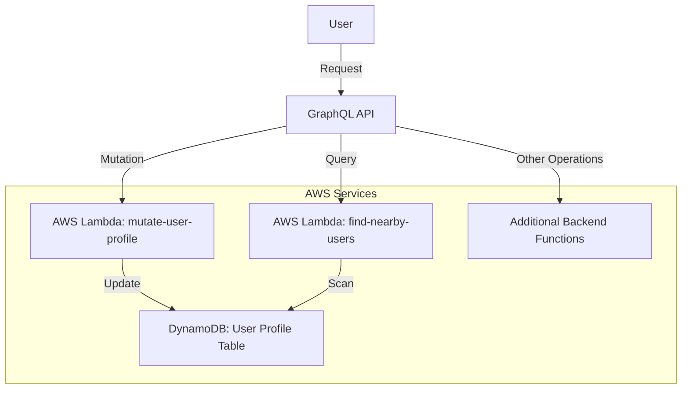

# Amplify Backend API

## Overview
This project is built with AWS Amplify and integrates backend services such as authentication, storage, and serverless functions. The backend primarily consists of AWS Lambda functions interacting with DynamoDB.

## Architecture

### AWS Services Used:
- **AWS Lambda** - Serverless functions handling business logic.
- **Amazon DynamoDB** - NoSQL database for user profiles.
- **AWS Amplify** - Framework for managing backend resources.
- **Amazon Cognito** - Handles authentication and user management.

### API Flow



## Backend Functions

### 1. `mutate-user-profile`
- **Purpose:** Updates user profile information.
- **Triggers:** GraphQL API Mutation.
- **Database Interaction:** Updates user profile records in DynamoDB.
- **Dependencies:** AWS SDK, GeoHash for location indexing.

### 2. `find-nearby-users`
- **Purpose:** Finds users near a given location.
- **Triggers:** GraphQL API Query.
- **Database Interaction:** Scans the DynamoDB user profile table based on GeoHash location.
- **Dependencies:** AWS SDK.

## Setup Instructions

1. **Install dependencies**
   ```sh
   npm install -g @aws-amplify/cli
   amplify pull
   ```

2. **Deploy the backend**
   ```sh
   amplify push
   ```

3. **Run local development**
   ```sh
   amplify mock function mutate-user-profile
   amplify mock function find-nearby-users
   ```

## Contributing
Please follow best practices for serverless development and GraphQL schema design.

## License
This project is licensed under the MIT License.

## TODOS
- add session based image caching to the search page.
    - be mindful that the cognito signed URLS only last 15min.