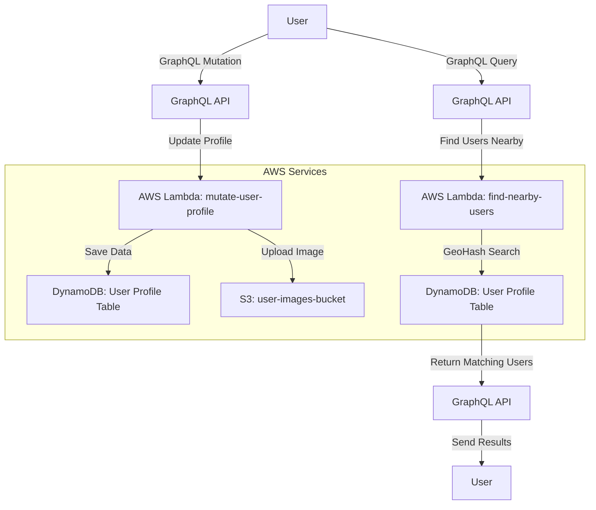

# Get Local Friends

## Overview
This project is dedicated to helping people find friends locally, based on geolocation and a personality quiz.

This is an AWS Amplify project integrates multiple backend services, including authentication, storage, and serverless functions. The architecture leverages AWS Lambda, DynamoDB, GraphQL, and S3 for handling user data, geospatial queries, and media storage.

## Architecture

### AWS Services Used:
- **AWS Lambda** - Serverless functions for business logic.
- **Amazon DynamoDB** - NoSQL database with geospatial indexing.
- **AWS Amplify** - Framework for managing backend resources.
- **Amazon Cognito** - User authentication and identity management.
- **Amazon S3** - Storage for user-uploaded images and data.

## API Flow with Geospatial Lookups & Storage



---

## Geospatial Lookup Using GeoHash

### How It Works
The **find-nearby-users** function leverages **GeoHashing** to efficiently search for nearby users. Instead of scanning all user profiles, it:
1. **Encodes latitude & longitude** into a compact GeoHash.
2. **Stores the GeoHash in DynamoDB**, allowing indexed queries.
3. **Queries users with matching GeoHash prefixes**, reducing search space.
4. **Adjusts precision dynamically**: 
   - Shorter GeoHash → Broader search radius.
   - Longer GeoHash → More precise location filtering.

### Example:
```js
import ngeohash from 'ngeohash';

// Encode coordinates
const geoHash = ngeohash.encode(42.3601, -71.0589, precision = 6);
console.log(geoHash); // 'drt3m3'

// Decode to get approximate location
const { latitude, longitude } = ngeohash.decode(geoHash);
```

### DynamoDB Storage Format:
| User ID  | Name  | Latitude | Longitude | GeoHash  |
|----------|-------|----------|----------|----------|
| U12345   | Alice | 42.36    | -71.05   | drt3m3   |
| U67890   | Bob   | 42.36    | -71.06   | drt3m3   |

---

## S3 Storage for User Images

### S3 Bucket Configuration
- **Bucket Name:** `userimages-${AWS_BRANCH}`
- **Storage Rules:** Defined via `defineStorage()`
- **Access Controls:** Restricted based on user authentication
- **Typical Usage:** Profile pictures, user-uploaded media

### Uploading an Image via Amplify Storage:
```js
import { Storage } from 'aws-amplify';

async function uploadImage(file) {
    const result = await Storage.put(`profile-pictures/${file.name}`, file, {
        contentType: file.type
    });
    console.log('Uploaded to S3:', result.key);
}
```

### Retrieving an Image:
```js
const imageUrl = await Storage.get('profile-pictures/user123.jpg');
console.log('Image URL:', imageUrl);
```

---

## Backend Functions

### 1. `mutate-user-profile`
- **Purpose:** Updates user profile information, including images.
- **Triggers:** GraphQL API Mutation.
- **Database Interaction:** Updates DynamoDB and uploads media to S3.
- **Dependencies:** AWS SDK, GeoHash for location indexing.

### 2. `find-nearby-users`
- **Purpose:** Finds users near a given location using GeoHash.
- **Triggers:** GraphQL API Query.
- **Database Interaction:** Searches DynamoDB for users within a proximity range.
- **Dependencies:** AWS SDK, `ngeohash` library.

---

## Setup Instructions

1. **Install dependencies**
   ```sh
   npm install -g @aws-amplify/cli
   amplify pull
   ```

2. **Deploy the backend**
   ```sh
   amplify push
   ```

3. **Run local development**
   ```sh
   amplify mock function mutate-user-profile
   amplify mock function find-nearby-users
   ```

## Contributing
Please follow best practices for serverless development and GraphQL schema design.

## License
This project is licensed under the MIT License.


## TODOs
- User Profile:
    - add users Name to list of things
    - add bio about user
    - add spirit animal that user is, and what they are looking for
- add social share badge.